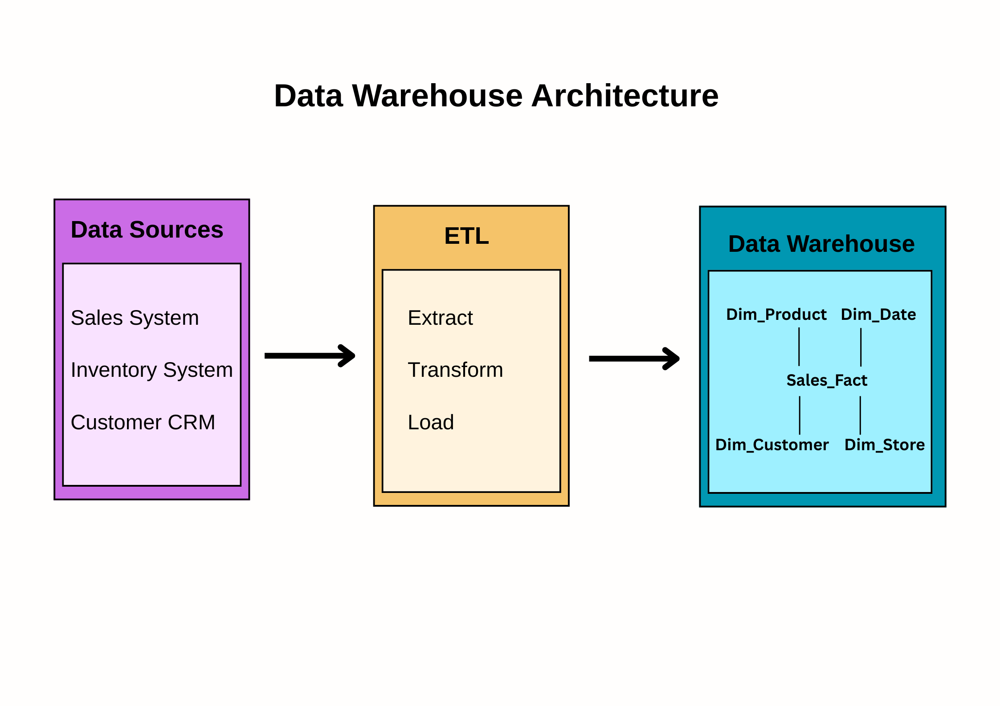
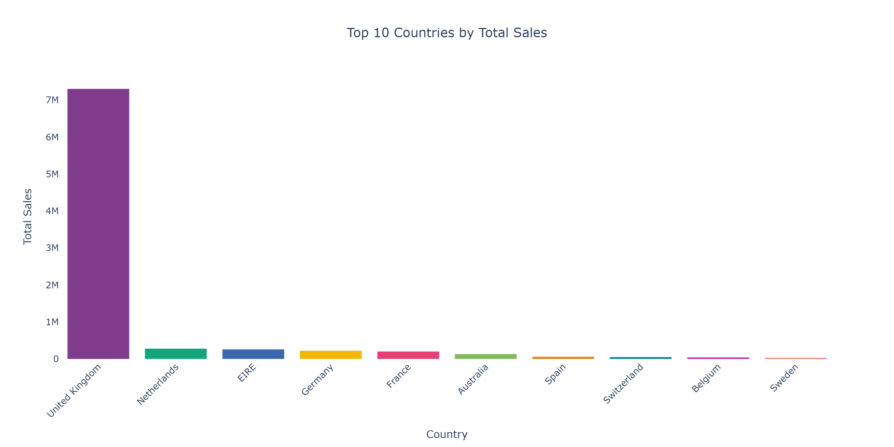
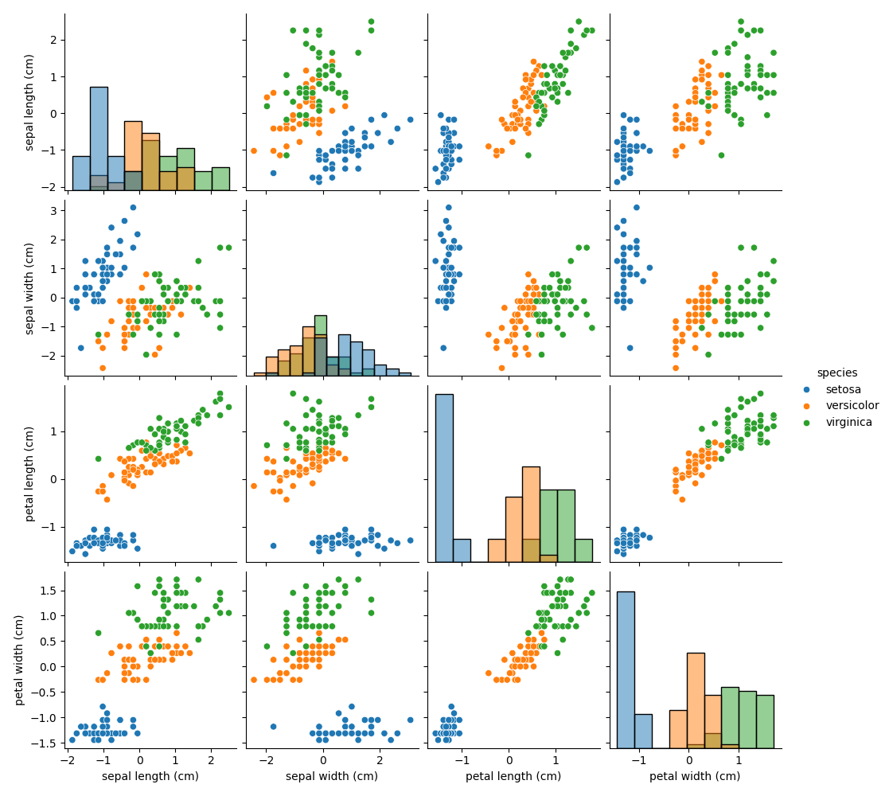
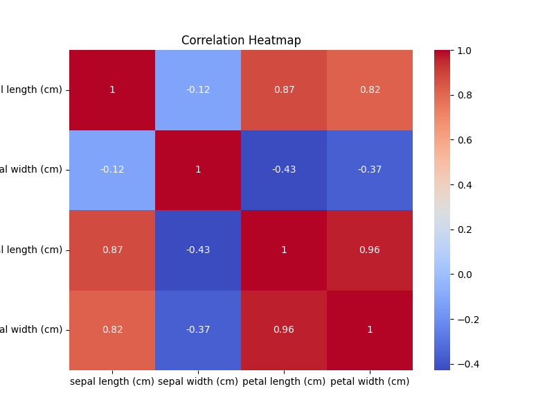

# Final Exam Project: DSA 2040
### Faith Mwangi (954)

## Overview
This repository consolidates all tasks from **Data Warehousing** and **Data Mining**, including detailed explanations, diagrams, analyses, and results.  
It covers designing a sales data warehouse, performing OLAP analyses, preprocessing data, clustering, classification, and association rule mining.

[View the Ultimate Report](DSA_2040_ultimate_report.md)

---

## File Structure

data_warehousing/
├── data/
│ ├── raw/
│ │ └── OnlineRetail.xlsx
│ ├── processed/
│ │ └── OnlineRetail_cleaned.csv
├── design/
│ ├── architecture_diagram.png
│ ├── schema_diagram.png
│ ├── sample_data.sql
│ ├── star_schema.sql
│ ├── queries.sql
│ └── design_report.md
├── etl/
│ ├── etl_retail.py
│ ├── etl_log.txt
│ ├── OnlineRetail_cleaned_summary.html
│ └── retail_dw.db
├── olap/
│ ├── chart_1_top10_countries.png
│ ├── chart_2_stacked_by_category.png
│ ├── chart_3_monthly_trend.png
│ ├── dashboard.html
│ ├── olap_analysis.py
│ ├── olap_dashboard.pdf
│ ├── olap_dashboard.py
│ ├── olap_queries.sql
│ └── olap_report.md
data_mining/
├── data_exploration/
│ ├── eda.py
│ ├── preprocessing.py
│ ├── report.py
│ ├── main.py
│ ├── iris_report.md
│ └── pycache/
├── task1_output/
│ ├── iris_raw.csv
│ ├── iris_scaled.csv
│ ├── iris_missing_values.png
│ ├── iris_pairplot_raw.png
│ ├── iris_pairplot_scaled.png
│ ├── iris_correlation_heatmap.png
│ └── iris_report.md
LICENSE
README.md
DSA_2040_ultimate_report.md
ultimate_report.py

---

## Data Warehousing

### Task 1: Star Schema Design

#### Why Star Schema?
The **Star Schema** is chosen for its query performance and simplicity.  
- Central fact table: `Sales_Fact`
- Dimension tables: `Dim_Product`, `Dim_Customer`, `Dim_Date`, `Dim_Store`  

| Feature           | Star Schema         | Snowflake Schema       |
|-------------------|-------------------|----------------------|
| Structure         | Simple, denormalized | Complex, normalized |
| Query Performance | Fast               | Slower               |
| Storage           | More redundancy    | Less redundancy      |

#### Architecture Diagram

*Data Source → ETL → Data Warehouse → Analysis*

#### Schema Diagram

*Shows relationships between fact and dimension tables.*

#### Data Dictionary (Summary)
- **Fact Table:** `Sales_Fact` (sales metrics: quantity sold, total sales)  
- **Dimensions:** Products, Customers, Dates, Stores  
*(see [sample_data.sql](data_warehousing/design/sample_data.sql) for sample inserts)*

---

### Task 2: OLAP Analysis

#### Roll-up: Top Countries

*UK and Germany are top performers.*

#### Drill-down: Category Trends

*Monthly peaks in Nov–Dec, especially for Electronics.*

#### Slice: Monthly Trend

**Insights**
- OLAP enables quick, multi-dimensional queries.
- **Key Findings:** UK/Germany lead sales; peak months are Nov–Dec; Electronics dominates revenue.

---

## Data Mining

### Task 1: Preprocessing & EDA (Iris Dataset)
- **Dataset:** scikit-learn Iris (150 samples, 4 features, 3 species)  
- **Preprocessing:** No missing values; StandardScaler applied.

#### Visualizations
- **Missing Values Heatmap**  
  
- **Pairplots (Raw/Scaled)**  
    
  
- **Correlation Heatmap**  
  

*All datasets saved as CSV for reproducibility.*

---

### Task 2: Clustering
- **Algorithm:** K-Means (k=2, 3, 4; best k=3)  
- **Metrics:** See [`kmeans_results.csv`](data_mining/task2_output/kmeans_results.csv)

#### Elbow Curve

#### Cluster Plots
- **K=2:**   
- **K=3:**   
- **K=4:** 

*Analysis: Clustering aligns well with true species; k=3 optimal.*

---

### Task 3: Classification & Association Rule Mining

#### Classification
- **Models:** Decision Tree, KNN (k=5)  
- **Results:**  

| Classifier     | Accuracy | Precision | Recall | F1    |
|----------------|---------|-----------|-------|-------|
| Decision Tree  | 0.93    | 0.93      | 0.93  | 0.93  |
| KNN            | 0.93    | 0.94      | 0.93  | 0.93  |

- **Visualization:**  
  

---

## License
MIT License—free to use, modify, and distribute for educational purposes.
