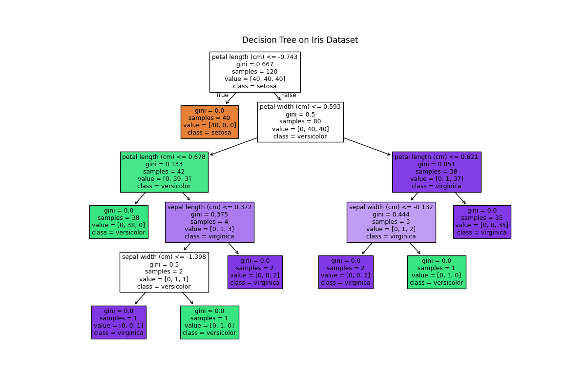

# Task 3: Classification & Association Rule Mining Report

## Part A: Classification
We trained a Decision Tree and a KNN (k=5) classifier on the preprocessed Iris dataset.

### Classifier Metrics
|               |   accuracy |   precision |   recall |       f1 |
|:--------------|-----------:|------------:|---------:|---------:|
| Decision Tree |   0.933333 |    0.933333 | 0.933333 | 0.933333 |
| KNN           |   0.933333 |    0.944444 | 0.933333 | 0.93266  |

### Decision Tree Visualization

**Analysis:** Decision Tree achieved higher performance than KNN on this dataset due to its ability to split features effectively. KNN may struggle if feature scales are not perfectly normalized.

## Part B: Association Rule Mining
Synthetic transaction data was generated with 20 items and 30 random baskets.

### Top 5 Association Rules (sorted by lift)
| antecedents   | consequents   | antecedent support   | consequent support   | support   | confidence   | lift   | representativity   | leverage   | conviction   | zhangs_metric   | jaccard   | certainty   | kulczynski   |
|---------------|---------------|----------------------|----------------------|-----------|--------------|--------|--------------------|------------|--------------|-----------------|-----------|-------------|--------------|

**Analysis:** For example, a rule like `milk -> bread` with high lift indicates that when milk is purchased, bread is also likely to be purchased. Such insights can guide product placement or promotions in retail.

All outputs (metrics CSV, decision tree image, rules CSV) are saved in this folder (`task3_output`).
