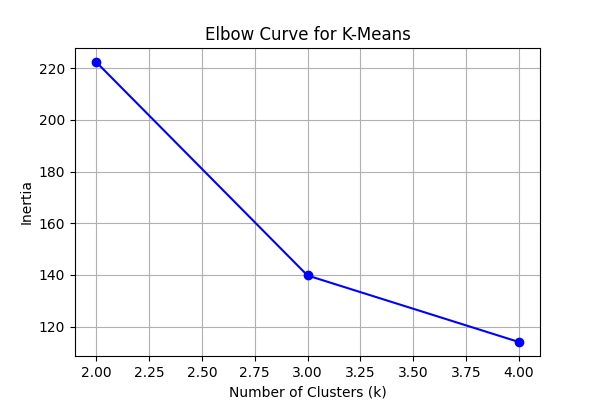
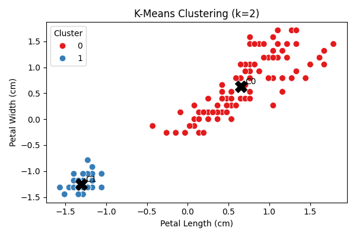
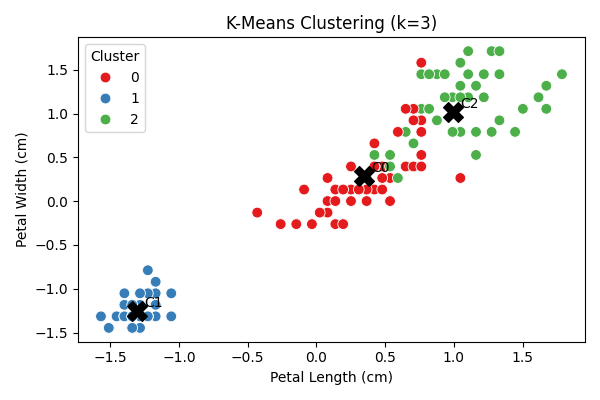
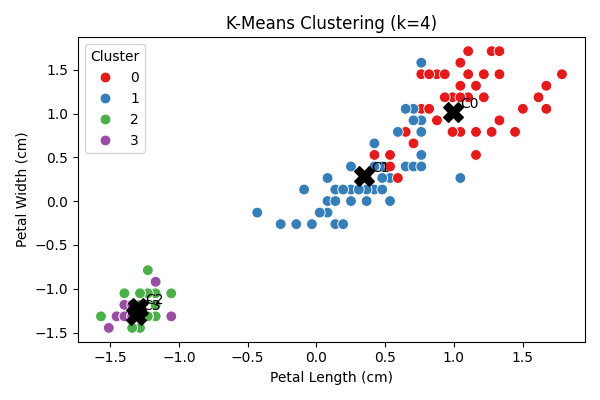

# Iris Dataset Clustering Report

This report summarizes K-Means clustering results on the Iris dataset using preprocessed data from Task 1.

## Dataset & Preprocessing
- **Dataset source:** scikit-learn Iris dataset, preprocessed (scaled features).
- **Features used:** sepal length, sepal width, petal length, petal width.
- **Target labels:** species (setosa, versicolor, virginica).

## K-Means Clustering Experiments
We applied K-Means clustering with different values of k (2, 3, 4) and evaluated cluster quality.

### Results Table
Metrics for each k are saved in [`kmeans_results.csv`](kmeans_results.csv).

### Elbow Curve
Shows inertia vs number of clusters to justify the choice of k.

### Cluster Scatter Plots
Scatter plots of petal length vs petal width for each k. Clusters are colored and centroids are marked with 'X'.
#### K = 2

#### K = 3

#### K = 4

## Analysis
K-Means with k=3 aligns well with the three species. ARI indicates strong agreement with true labels. K=2 merges some species, reducing ARI, while k=4 splits one species, slightly reducing cluster quality. Silhouette scores and inertia support k=3 as the optimal cluster count. Misclassifications mostly occur between versicolor and virginica, consistent with overlapping feature ranges. Real-world application: similar clustering can segment customers based on features in marketing or biology. Synthetic data (if used) may affect cluster separability slightly, but overall trends are preserved.

All outputs (CSV, plots) are saved in this folder (`task2_output`) to meet the Task 2 rubric requirements.
