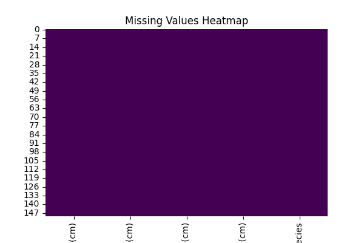
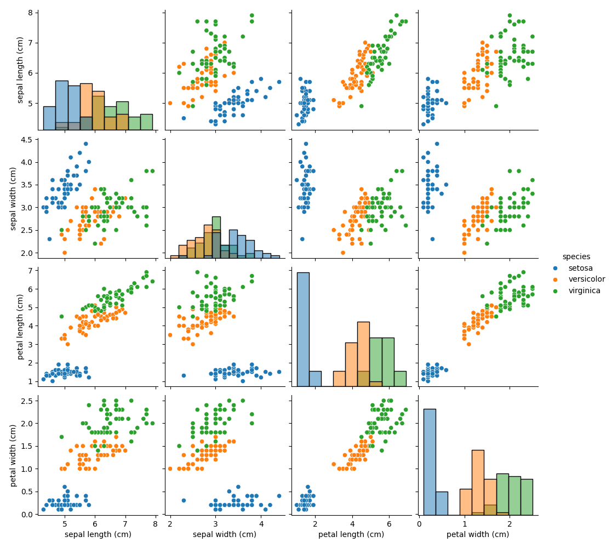
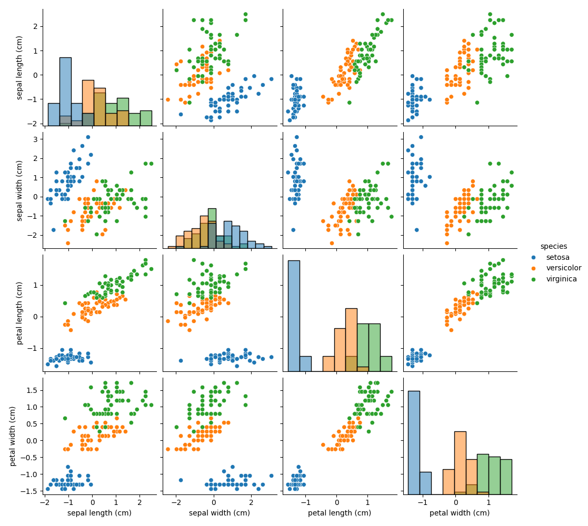

# Iris Dataset Preprocessing & EDA Report

This report summarizes the preprocessing and exploratory data analysis (EDA) outputs for the Iris dataset.

## Dataset Description
- **Dataset source:** scikit-learn's built-in Iris dataset (`sklearn.datasets.load_iris()`)
- **Samples:** 150
- **Features:** sepal length, sepal width, petal length, petal width
- **Target/Label:** species (setosa, versicolor, virginica)

## Preprocessing
1. Checked for missing values and none were found. A heatmap visualization is included below.
2. Numerical features were standardized using `StandardScaler` to prepare the data for further analysis or ML models.
3. Raw and scaled datasets are saved as CSV files for reproducibility.

### CSV Files
- Raw dataset: [`iris_raw.csv`](iris_raw.csv)
- Scaled dataset: [`iris_scaled.csv`](iris_scaled.csv)

## Exploratory Data Analysis (EDA)
EDA helps understand feature distributions, relationships, and potential outliers.

### Missing Values Heatmap
Shows whether there are any missing values in the dataset. Light areas indicate missing values.

### Pairplot - Raw Data
Visualizes the pairwise relationships between features before scaling. Colors indicate species.

### Pairplot - Scaled Data
Pairplot after scaling numerical features, demonstrating that relationships between features are preserved.

### Correlation Heatmap
Shows the Pearson correlation between numerical features. Strong positive/negative correlations are highlighted.

## Summary
- The dataset is clean with no missing values.
- Standardization was applied to numerical features.
- EDA plots reveal relationships between features and species.
- All preprocessing and EDA outputs are saved in this folder (`task1_output`) to meet Task 1 rubric requirements.
