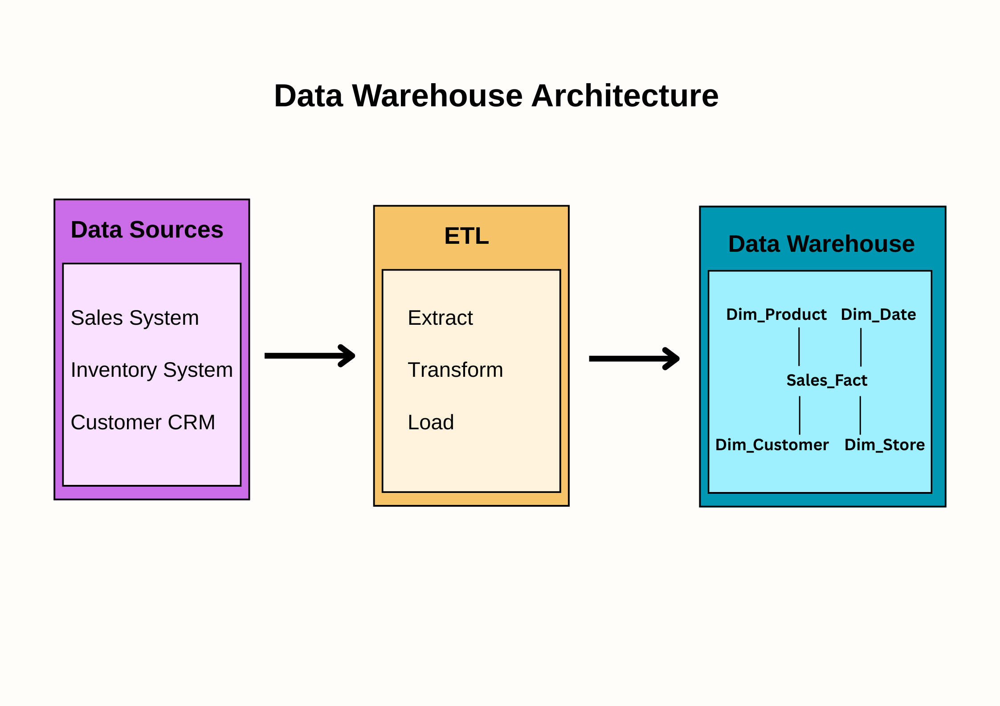
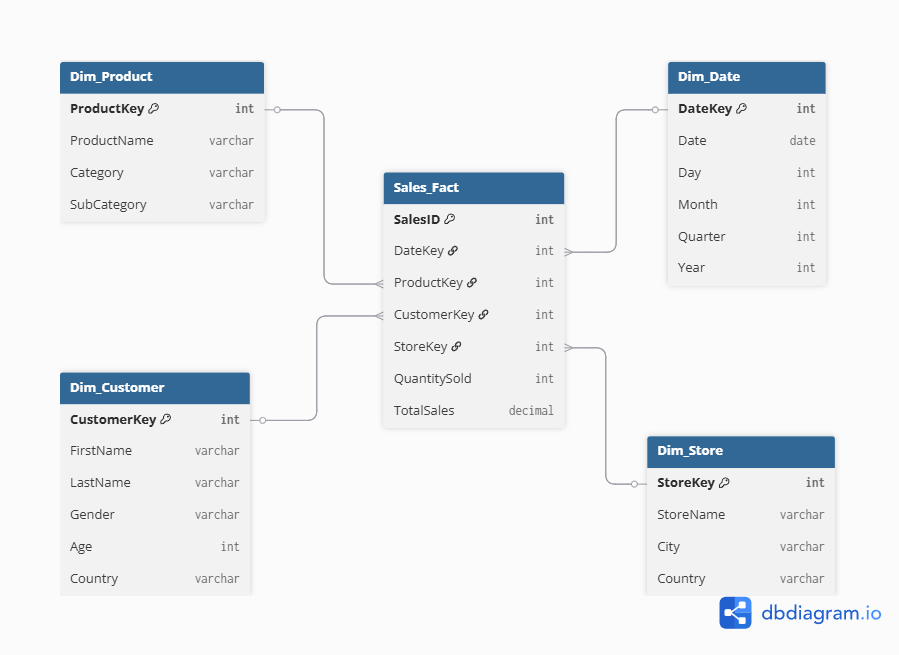

# Data Warehouse Star Schema Design Report

## 1. Introduction

In this report, I describe how I designed a **Sales Data Warehouse** using the **Star Schema** approach. It includes a schema diagram, a basic architecture diagram, SQL table definitions, some sample data, and example queries to test if the design works as expected.

---

## 2. Star Schema Overview

The **Star Schema** is a type of database design that has a **central fact table** that stores the important business events (like sales), and several **dimension tables** that describe those events in more detail (like information about the product, customer, time, and store). 

For this project, here’s what I included:

- **Fact Table:** `Sales_Fact`  
  - This table holds the main numbers I want to analyze (like quantity sold and total sales).
- **Dimension Tables:**  
  - `Dim_Product`: Information about each product, including which category it’s in.
  - `Dim_Customer`: Info about customers, like their names, gender, age, and country.
  - `Dim_Date`: Calendar information to make time-based analysis easier.
  - `Dim_Store`: Store location details.

---

## 3. Why use the Star Schema over the Snowflake Schema?

The **Star Schema** keeps dimension tables denormalized (fewer joins, simpler queries) while the **Snowflake Schema** normalizes dimensions into multiple related tables.

| Feature               | Star Schema                       | Snowflake Schema                 |
|-----------------------|------------------------------------|-----------------------------------|
| Structure             | Fact table + denormalized dimensions | Fact table + normalized dimensions |
| Query Performance     | Faster, fewer joins               | Slower, more joins                |
| Storage Requirements  | Higher (data redundancy)          | Lower (less redundancy)           |
| Complexity            | Simple design, easy to understand | More complex, harder to maintain  |

For this warehouse, the **Star Schema** was chosen to optimize for **query performance** and **ease of use** in reporting.


---

## 4. Architecture Diagram

  
**Flow:** Data Source → ETL → Data Warehouse (Star Schema) 

I tried to show the basic flow in my diagram: data comes in from the source, goes through ETL (Extract, Transform, Load), gets stored in my star schema, and then is used for analysis and dashboards.

---

## 5. Schema Diagram

  
This diagram shows how the fact table connects to each dimension table using primary keys (PK) and foreign keys (FK). This helps understand the relationships much better.

---

## 6. Data Dictionary

### 6.1 Fact Table: `Sales_Fact`
| Column        | Type        | Description                               |
|---------------|-------------|-------------------------------------------|
| SalesID       | INT (PK)    | Unique identifier for each sales record   |
| DateKey       | INT (FK)    | Links to `Dim_Date`                       |
| ProductKey    | INT (FK)    | Links to `Dim_Product`                    |
| CustomerKey   | INT (FK)    | Links to `Dim_Customer`                   |
| StoreKey      | INT (FK)    | Links to `Dim_Store`                      |
| QuantitySold  | INT         | Number of units sold                      |
| TotalSales    | DECIMAL     | Total sales value                         |

### 6.2 Dimension Tables

#### `Dim_Product`
| Column        | Type        | Description                  |
|---------------|-------------|------------------------------|
| ProductKey    | INT (PK)    | Unique product identifier    |
| ProductName   | TEXT        | Name of the product          |
| Category      | TEXT        | High-level product category  |
| SubCategory   | TEXT        | More specific classification |

#### `Dim_Customer`
| Column        | Type        | Description                  |
|---------------|-------------|------------------------------|
| CustomerKey   | INT (PK)    | Unique customer identifier   |
| FirstName     | TEXT        | Customer's first name        |
| LastName      | TEXT        | Customer's last name         |
| Gender        | TEXT        | Gender of customer           |
| Age           | INT         | Age of customer              |
| Country       | TEXT        | Country of customer          |

#### `Dim_Date`
| Column        | Type        | Description                  |
|---------------|-------------|------------------------------|
| DateKey       | INT (PK)    | Unique date in YYYYMMDD format|
| DateValue     | DATE        | Calendar date                |
| Day           | INT         | Day of the month             |
| Month         | INT         | Month number                 |
| Quarter       | INT         | Quarter number (1-4)         |
| Year          | INT         | Year value                   |

#### `Dim_Store`
| Column        | Type        | Description                  |
|---------------|-------------|------------------------------|
| StoreKey      | INT (PK)    | Unique store identifier      |
| StoreName     | TEXT        | Name of store                |
| City          | TEXT        | City where store is located  |
| Country       | TEXT        | Country of store             |

---

## 7. Sample Data

A small SQL script called [`sample_data.sql`](sample_data.sql) to add some initial data for testing. Here are a few examples:

```sql
-- Sample product
INSERT INTO Dim_Product (ProductName, Category, SubCategory)
VALUES ('Laptop', 'Electronics', 'Computers');

-- Sample customer
INSERT INTO Dim_Customer (FirstName, LastName, Gender, Age, Country)
VALUES ('Faith', 'Mwangi', 'Female', 18, 'KE');

-- Sample date
INSERT INTO Dim_Date (DateKey, DateValue, Day, Month, Quarter, Year)
VALUES (20240801, '2024-08-01', 1, 8, 3, 2024);

-- Sample store
INSERT INTO Dim_Store (StoreName, City, Country)
VALUES ('Kilimani', 'Nairobi', 'KE');

-- Sample sales fact
INSERT INTO Sales_Fact (DateKey, ProductKey, CustomerKey, StoreKey, QuantitySold, TotalSales)
VALUES (20240801, 1, 1, 1, 2, 2000.00);
```
