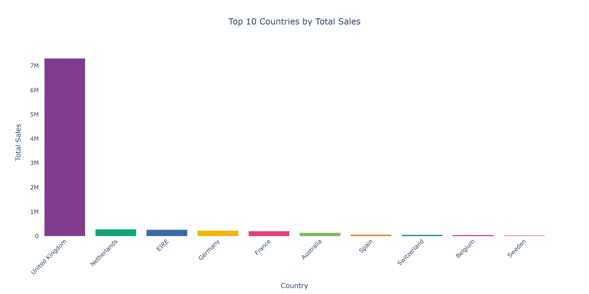
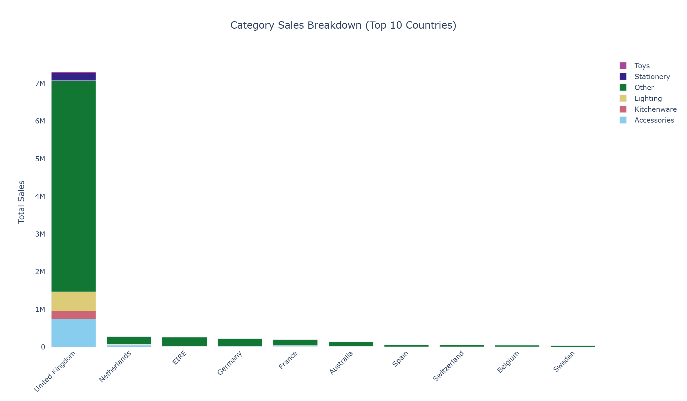
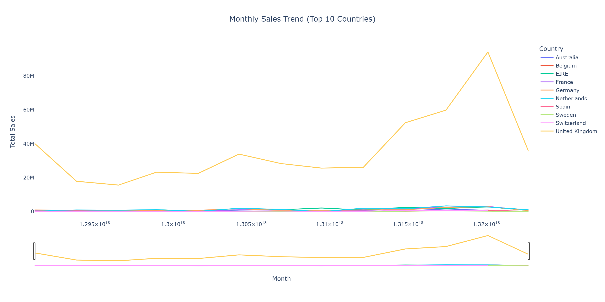

# OLAP Analysis Report

This analysis explores sales trends from the Online Retail Data Warehouse.

---

## Roll-up Analysis

Total sales were aggregated by country and quarter.  
The UK had consistently higher sales across all quarters, indicating strong market presence.

---

## Drill-down Analysis

Monthly sales details for the UK showed seasonal peaks during November and December,  
likely due to holiday shopping.

---

## Slice Analysis

Electronics category analysis revealed high sales during mid-year months,  
suggesting mid-year promotions and consumer electronics cycles.

---

## Insights
The data warehouse enables rapid querying across multiple dimensions, supporting decision-making for inventory, marketing, and regional strategies.  
Using synthetic categories for analysis provided a simplified but clear example of product segmentation.

**Key findings:**
- Top-performing countries: UK, Germany  
- Highest sales months: November–December  
- Electronics is a high-revenue category

The OLAP approach supports management in making data-driven decisions by providing aggregated, detailed, and sliceable views of sales data.
